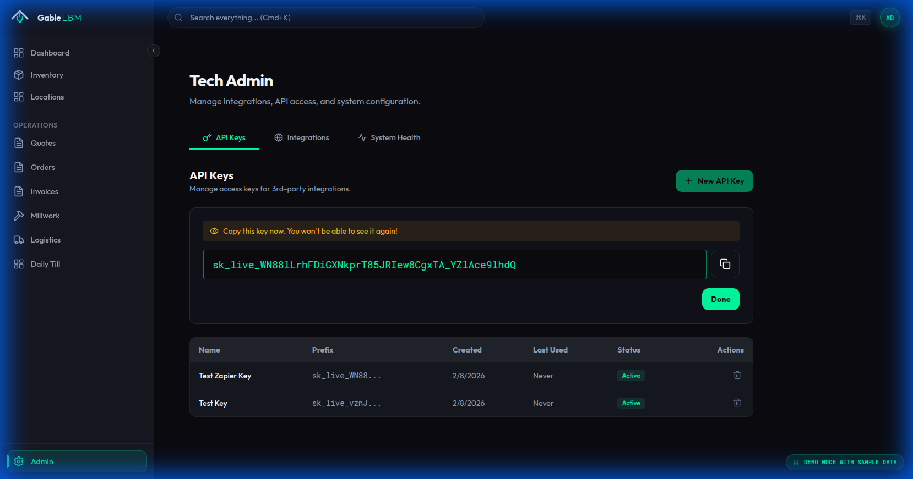
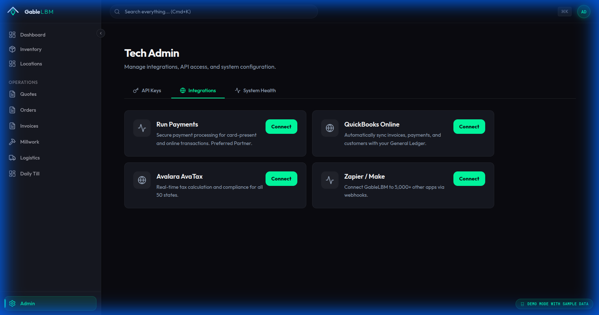
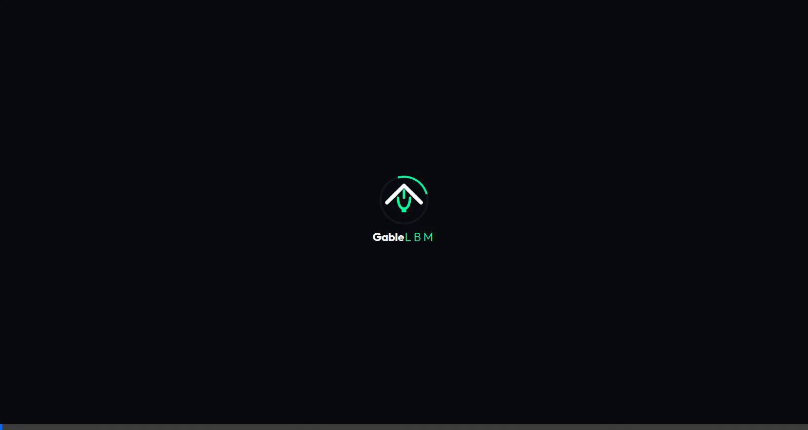
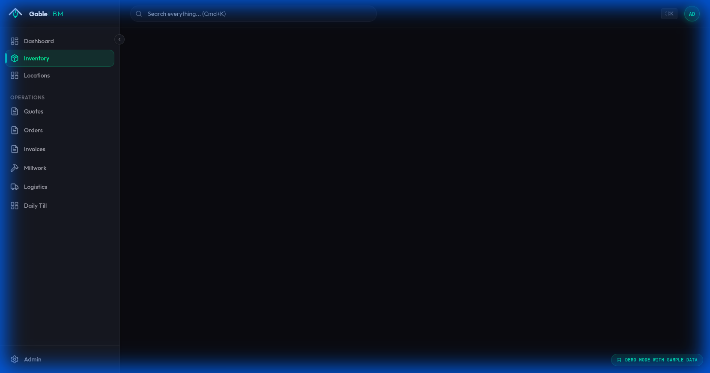
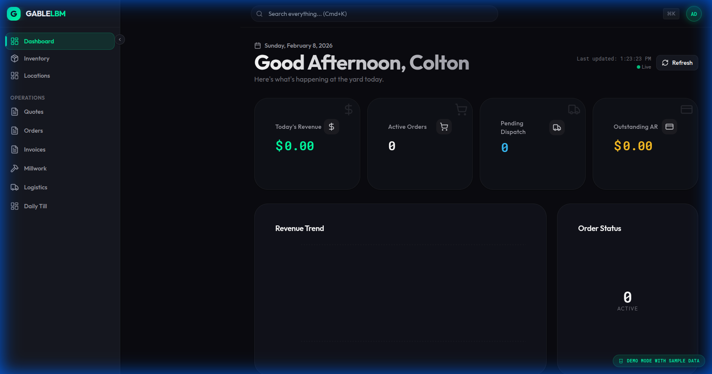
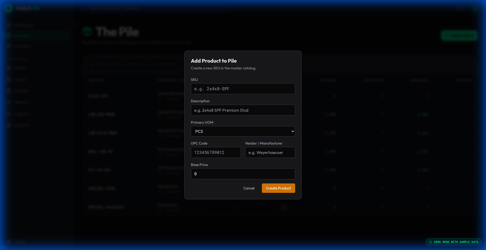

# Tech Admin Panel & Fixes Walkthrough

This document outlines the verification of the new Tech Admin Panel and the resolution of the Inventory navigation issue, along with a gallery of the current system state.

## 1. Tech Admin Panel
The new `/admin` panel allows non-technical administrators to manage API keys and integrations.

### Verification Steps
1.  **Initial State**: Navigated to `/admin`, confirmed empty state.
2.  **Generating Key**: Created "Test Zapier Key". System displayed secret key once.
3.  **Active List**: Verified new key appears in the list.
4.  **Integrations**: Checked the integrations tab.

### Recording

---

## 2. Inventory Navigation Fix
**Issue**: Navigating to `/inventory` resulted in a blank screen due to API port mismatch (8085 vs 8080).
**Fix**: Updated all frontend services to use port 8080 via `.env`.

### Verification
I verified that clicking "Inventory" from the dashboard now loads the page immediately without requiring a refresh.

The navigation logic is now robust and connects to the running backend.

---

## 3. System Gallery

Below is a collection of screenshots verifying the current state of the application across various modules.

### Dashboard & Analytics

### Inventory Management

### Logistics & Dispatch

### Sales & Governance

