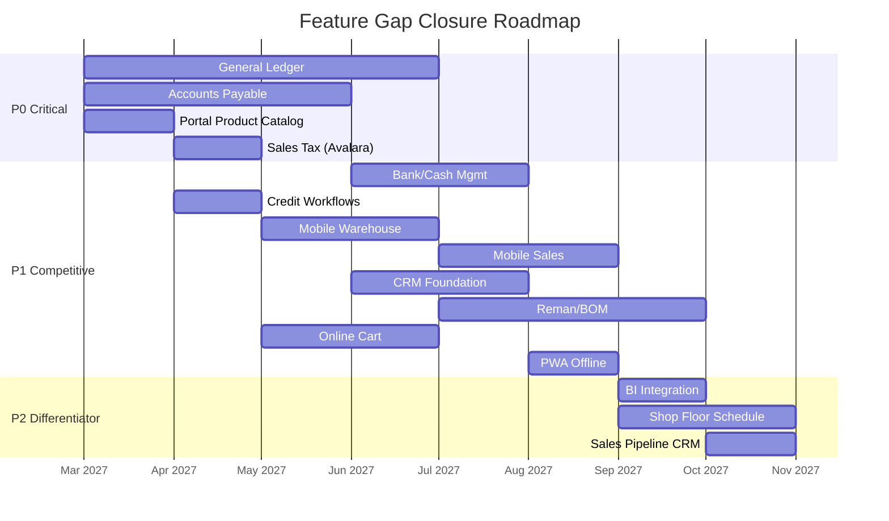

# Competitive Gap Analysis: GableERP vs. Industry Incumbents

> **Purpose**: Map every feature gap between GableERP's current state and the four LBM ERP incumbents (DMSi Agility, Intact GenetiQ, Epicor BisTrack, ECI Spruce). Gaps are prioritized by competitive urgency and grouped by functional area.
>
> **Source Research**: [competitor_analysis.md](file:///home/colton/Desktop/4C%20Digital_HQ/Lumber%20Digital%20Tools/GableLBM/GableERP/productdocs/competitor_analysis.md) · [competitor_analysis_dmsi.md](file:///home/colton/Desktop/4C%20Digital_HQ/Lumber%20Digital%20Tools/GableLBM/GableERP/productdocs/competitor_analysis_dmsi.md) · [competitor_analysis_intact.md](file:///home/colton/Desktop/4C%20Digital_HQ/Lumber%20Digital%20Tools/GableLBM/GableERP/productdocs/competitor_analysis_intact.md)

---

## Gap Summary Dashboard

| Area | Parity Gaps | Leapfrog Opportunities | Risk Level |
|:---|:---:|:---:|:---|
| Financials & Accounting | 8 | 1 | 🔴 Critical |
| Inventory & Warehouse | 4 | 2 | 🟡 Medium |
| Sales & POS | 3 | 2 | 🟡 Medium |
| E-Commerce & Portal | 4 | 1 | 🟡 Medium |
| Logistics & Delivery | 3 | 1 | 🟢 Low |
| Production & Millwork | 3 | 1 | 🟡 Medium |
| CRM | 5 | 0 | 🟡 Medium |
| Reporting & BI | 4 | 1 | 🟡 Medium |
| Mobile | 3 | 2 | 🟡 Medium |
| Integrations | 5 | 1 | 🟡 Medium |
| **Total** | **42** | **12** | |

---

## 1. Financials & Accounting 🔴

> [!CAUTION]
> This is the **largest competitive gap**. Every incumbent ships a full accounting suite. GableERP has "Financials Lite" (invoicing, payment collection, daily till, basic AR). Dealers evaluating GableERP will immediately ask: "Can I run my books in this?"

### Parity Gaps

| # | Gap | Who Has It | GableERP Status | Priority |
|:---|:---|:---|:---|:---|
| F1 | **General Ledger (Full)** — Chart of accounts, journal entries, trial balance, period closing | All 4 | ❌ Not built (GL sync to QuickBooks exists, but no native GL) | P0 |
| F2 | **Accounts Payable** — Vendor invoice entry, PO matching, payment scheduling, check runs | All 4 | ❌ Not built | P0 |
| F3 | **Bank / Cash Management** — Bank reconciliation, cash flow tracking | GenetiQ, BisTrack, Agility | ❌ Not built | P1 |
| F4 | **Fixed Asset Register** — Track vehicles, forklifts, equipment | GenetiQ | ❌ Not built | P2 |
| F5 | **Credit Control Workflows** — Dedicated credit review UI, credit request management, automated holds | GenetiQ, Agility | ⚠️ Basic (credit limit check on order confirm only) | P1 |
| F6 | **Finance Charges** — Auto-calculate late fees on past-due AR | BisTrack, Agility | ⚠️ Spec'd but not implemented | P1 |
| F7 | **AIA Progress Billing** — Construction industry standard billing format | BisTrack | ⚠️ Spec'd but not implemented | P2 |
| F8 | **Rebate Tracking** — Vendor volume rebate management | Agility, BisTrack | ❌ Not built | P2 |

### Leapfrog Opportunity
| # | Opportunity | Description |
|:---|:---|:---|
| F-L1 | **AI Cash Flow Forecasting** | None of the incumbents offer predictive cash flow. GableERP could predict AR collection timing using payment history patterns and flag likely defaults before they happen. |

---

## 2. Inventory & Warehouse 🟡

### Parity Gaps

| # | Gap | Who Has It | GableERP Status | Priority |
|:---|:---|:---|:---|:---|
| I1 | **Tally Management (Receiving)** — Random width/length assessment for hardwood, convert to inventory | Agility, BisTrack | ⚠️ Spec'd but not implemented | P1 |
| I2 | **Remanufacturing / Reman** — Break bulk workflows (turn 2x4x16s into studs), BOM-based production | Agility (best), BisTrack | ⚠️ Spec'd but not implemented | P1 |
| I3 | **Cycle Count Program** — Scheduled counting with ABC classification, variance tracking | All 4 | ⚠️ Basic adjustment tool exists, no program | P1 |
| I4 | **Barcode / RFID Scanning** — Native mobile scanning for receiving, picking, counting | All 4 | ⚠️ Spec'd but no native scanner integration | P1 |

### Leapfrog Opportunities
| # | Opportunity | Description |
|:---|:---|:---|
| I-L1 | **AI Vision Tally** | DMSi has TallyExpress (Android, 99.8% accuracy, boards only). GableERP should do tally + material list parsing + blueprint reading on iOS AND Android. |
| I-L2 | **Geospatial Yard Management** | No competitor tracks inventory on a physical yard map. Real-time forklift/material positions would be a 10x differentiator per the disruption thesis. |

---

## 3. Sales & POS 🟡

### Parity Gaps

| # | Gap | Who Has It | GableERP Status | Priority |
|:---|:---|:---|:---|:---|
| S1 | **"Haggle" / Margin-Aware Negotiation** — Counter staff see real-time margin while adjusting price, with configurable max-discount limits | GenetiQ | ❌ Not built (pricing waterfall exists but no live margin negotiation UI) | P1 |
| S2 | **Lost Sales Analysis** — Track and analyze items customers asked for but didn't buy | GenetiQ | ❌ Not built | P2 |
| S3 | **Authorized Signer Verification** — ID check / signature capture for charge account transactions | Agility, BisTrack | ⚠️ Spec'd but not implemented | P1 |

### Leapfrog Opportunities
| # | Opportunity | Description |
|:---|:---|:---|
| S-L1 | **AI-Suggested Pricing** | Position as the evolution of GenetiQ's "Haggle" — instead of manual negotiation, AI suggests the optimal price to win the job based on competitor pricing, customer history, and margin targets. |
| S-L2 | **Voice-to-Order** | No competitor offers voice input. Counter reps could dictate orders instead of typing/scanning. |

---

## 4. E-Commerce & Portal 🟡

### Parity Gaps

| # | Gap | Who Has It | GableERP Status | Priority |
|:---|:---|:---|:---|:---|
| E1 | **Product Catalog Browsing** — Online catalog with images, descriptions, specs | Agility Commerce Cloud, GenetiQ (Aphix), Spruce | ⚠️ Sprint 16 portal exists but no product catalog browsing | P0 |
| E2 | **Online Ordering / Cart** — Full shopping cart with checkout, account-specific pricing | Agility Commerce Cloud, GenetiQ | ⚠️ Sprint 16 portal has "Buy Again" but no full cart/browse flow | P1 |
| E3 | **No-Code CMS** — Dealer-managed content pages, images, videos, advertising | Agility Commerce Cloud | ❌ Not built | P2 |
| E4 | **Guest User Administration** — Contractors manage their own team's portal access | Agility Commerce Cloud | ❌ Not built | P1 |

### Leapfrog Opportunity
| # | Opportunity | Description |
|:---|:---|:---|
| E-L1 | **Sovereign White-Label Portal** | GableERP's portal runs on dealer's domain with their brand. Competitors lock the portal to their platform. This IS the "Sovereignty" thesis. |

---

## 5. Logistics & Delivery 🟢

### Parity Gaps

| # | Gap | Who Has It | GableERP Status | Priority |
|:---|:---|:---|:---|:---|
| L1 | **Automatic Customer Notifications** — SMS/email: "Your delivery is staged / out for delivery / delivered" | Agility, GenetiQ | ❌ Not built (POD exists but no push notifications) | P1 |
| L2 | **Driver On-Site Quantity Adjustment** — Driver changes invoice quantities at job site (short-ship resolution) | Agility | ❌ Not built | P1 |
| L3 | **Fleet Tracking Integration** — Real-time GPS fleet integration (DQT, Trimble) | Agility, BisTrack | ❌ Not built | P2 |

### Leapfrog Opportunity
| # | Opportunity | Description |
|:---|:---|:---|
| L-L1 | **Self-Driving Logistics** | Fully autonomous load building + routing per disruption thesis. AI suggests load ORDER (last stop on bottom) AND route that maximizes profit per mile. |

---

## 6. Production & Millwork 🟡

### Parity Gaps

| # | Gap | Who Has It | GableERP Status | Priority |
|:---|:---|:---|:---|:---|
| M1 | **Shop Floor Scheduling** — Production line scheduling, capacity planning, resource allocation | Agility (best), BisTrack | ❌ Not built | P2 |
| M2 | **Multi-Level BOM** — Complex bills of materials for assembled/remanufactured products | Agility, BisTrack | ⚠️ Sprint 19 configurator in progress (single-level) | P1 |
| M3 | **Work Order Management** — Issue materials, track WIP, receive finished goods | Agility, GenetiQ | ❌ Not built | P1 |

### Leapfrog Opportunity
| # | Opportunity | Description |
|:---|:---|:---|
| M-L1 | **AI Blueprint Verification** | Sprint 19 includes prototype. Use vision AI to verify configurator output matches blueprint specs. No competitor does this. |

---

## 7. CRM 🟡

### Parity Gaps

| # | Gap | Who Has It | GableERP Status | Priority |
|:---|:---|:---|:---|:---|
| C1 | **Contact Management** — Multiple contacts per account with roles, communication preferences | All 4 | ❌ Basic customer record only | P1 |
| C2 | **Activity Tracking** — Log calls, meetings, visits; schedule follow-ups | Agility, GenetiQ, BisTrack | ❌ Not built | P1 |
| C3 | **Sales Pipeline** — Track opportunities from prospect to close | Agility, GenetiQ | ❌ Not built | P2 |
| C4 | **Team/Division Sharing** — Cross-division visibility into customer interactions | Agility | ❌ Not built | P2 |
| C5 | **Customer Self-Service Account Management** — Update contact info, manage addresses, set preferences | GenetiQ, Agility Commerce Cloud | ⚠️ Sprint 16 portal shows data but no self-edit | P1 |

---

## 8. Reporting & BI 🟡

### Parity Gaps

| # | Gap | Who Has It | GableERP Status | Priority |
|:---|:---|:---|:---|:---|
| R1 | **Pivot-Table / Ad-Hoc Analysis** — User-defined data exploration (slice/dice) | GenetiQ (Analyst), Agility (Phocas) | ❌ Not built (Sprint 15 has predefined dashboards only) | P1 |
| R2 | **Power BI / External BI Integration** — Direct data pipes to BI tools | GenetiQ, BisTrack | ❌ Not built | P2 |
| R3 | **Scheduled Report Distribution** — Auto-email reports on schedule | All 4 | ❌ Not built | P2 |
| R4 | **Drill-Down Reports** — Click a summary metric to see underlying detail | GenetiQ, BisTrack | ⚠️ Sprint 15 dashboard has some drill-down | P1 |

### Leapfrog Opportunity
| # | Opportunity | Description |
|:---|:---|:---|
| R-L1 | **Conversational Analytics** | "Chat with your data" — ask questions in natural language. Already spec'd in feature_spec.md as "Generative Sales." No competitor offers this. |

---

## 9. Mobile 🟡

### Parity Gaps

| # | Gap | Who Has It | GableERP Status | Priority |
|:---|:---|:---|:---|:---|
| MB1 | **Mobile Warehouse App** — Picking, receiving, counting with barcode scanning | All 4 | ❌ Not built (web UI only) | P1 |
| MB2 | **Mobile Sales App** — Outside sales reps check A/R, stock, pricing, create quotes on-site | Agility, GenetiQ | ❌ Not built | P1 |
| MB3 | **Offline Capability** — Work without connectivity (sync when back online) | GenetiQ | ❌ Not built (PWA planned) | P1 |

### Leapfrog Opportunities
| # | Opportunity | Description |
|:---|:---|:---|
| MB-L1 | **Cross-Platform AI Tally** | TallyExpress is Android-only. GableERP on iOS AND Android with broader AI capabilities (not just board counting). |
| MB-L2 | **PWA-First** | True PWA architecture means one codebase for mobile + desktop + offline, avoiding the native app maintenance burden. |

---

## 10. Integrations 🟡

### Parity Gaps

| # | Gap | Who Has It | GableERP Status | Priority |
|:---|:---|:---|:---|:---|
| IN1 | **Payment Processor Integration** — Worldpay, Billtrust, or equivalent | Agility (Worldpay/Billtrust), BisTrack | ⚠️ Stripe only (Sprint 7) | P1 |
| IN2 | **Sales Tax Engine** — Avalara or similar automated tax calculation | Agility (Avalara), BisTrack | ❌ Not built | P0 |
| IN3 | **Buying Group Integration** — NBG, LMC, Do-It-Best | GenetiQ (NBG), Agility | ❌ Not built | P2 |
| IN4 | **Credit Check Integration** — Creditsafe, D&B | GenetiQ (Creditsafe) | ❌ Not built | P2 |
| IN5 | **Labeling / Barcoding** — Loftware, Zebra | Agility (Loftware) | ❌ Not built | P2 |

### Leapfrog Opportunity
| # | Opportunity | Description |
|:---|:---|:---|
| IN-L1 | **Zero-Tax Open API Marketplace** | While competitors charge $5K–$15K for API access, GableERP provides free, documented APIs + a "one-click" integration marketplace (Sprint 21+). |

---

## Priority Matrix

### 🔴 P0 — Must close before first paid deployment

| ID | Gap | Est. Effort |
|:---|:---|:---|
| F1 | Full General Ledger | 3-4 sprints |
| F2 | Accounts Payable | 2-3 sprints |
| E1 | Product Catalog in Portal | 1 sprint |
| IN2 | Automated Sales Tax (Avalara) | 1 sprint |

### 🟠 P1 — Must close for competitive demos

| ID | Gap | Est. Effort |
|:---|:---|:---|
| F3 | Bank/Cash Management | 1-2 sprints |
| F5 | Credit Control Workflows | 1 sprint |
| F6 | Finance Charges (Auto Late Fees) | 0.5 sprint |
| I1 | Tally Management | 1 sprint |
| I2 | Remanufacturing | 2 sprints |
| I3 | Cycle Count Program | 0.5 sprint |
| I4 | Barcode/RFID Scanning | 1 sprint |
| S1 | Margin-Aware Price Negotiation | 1 sprint |
| S3 | Authorized Signer Verification | 0.5 sprint |
| E2 | Full Online Cart/Ordering | 1-2 sprints |
| E4 | Guest User Admin | 0.5 sprint |
| L1 | Customer Delivery Notifications | 0.5 sprint |
| L2 | Driver On-Site Qty Adjustments | 0.5 sprint |
| M2 | Multi-Level BOM | 1 sprint |
| M3 | Work Order Management | 1-2 sprints |
| C1 | Contact Management | 0.5 sprint |
| C2 | Activity Tracking | 1 sprint |
| C5 | Customer Self-Service Account Mgmt | 0.5 sprint |
| R1 | Ad-Hoc Pivot Analysis | 1-2 sprints |
| R4 | Drill-Down Reports | 0.5 sprint |
| MB1 | Mobile Warehouse App | 2 sprints |
| MB2 | Mobile Sales App | 1-2 sprints |
| MB3 | Offline Capability (PWA) | 1 sprint |
| IN1 | Payment Processor (beyond Stripe) | 1 sprint |

### 🟢 P2 — Nice to have for market differentiation

| ID | Gap | Est. Effort |
|:---|:---|:---|
| F4 | Fixed Asset Register | 1 sprint |
| F7 | AIA Progress Billing | 1 sprint |
| F8 | Rebate Tracking | 1 sprint |
| S2 | Lost Sales Analysis | 0.5 sprint |
| E3 | No-Code CMS | 1-2 sprints |
| L3 | Fleet Tracking Integration | 1 sprint |
| M1 | Shop Floor Scheduling | 2 sprints |
| C3 | Sales Pipeline | 1 sprint |
| C4 | Team/Division Sharing | 0.5 sprint |
| R2 | Power BI Integration | 1 sprint |
| R3 | Scheduled Report Distribution | 0.5 sprint |
| IN3 | Buying Group Integration | 1 sprint |
| IN4 | Credit Check Integration | 0.5 sprint |
| IN5 | Labeling Integration | 0.5 sprint |

---

## Estimated Gap Closure Timeline

> [!IMPORTANT]
> **Estimated P0 parity: Q3 2027.** This means GableERP can't credibly replace a dealer's full ERP until accounting is complete. Until then, GableERP is best positioned as a **"sales + operations layer"** running alongside QuickBooks/NetSuite for financials. This should be the GTM message for early adopters.
