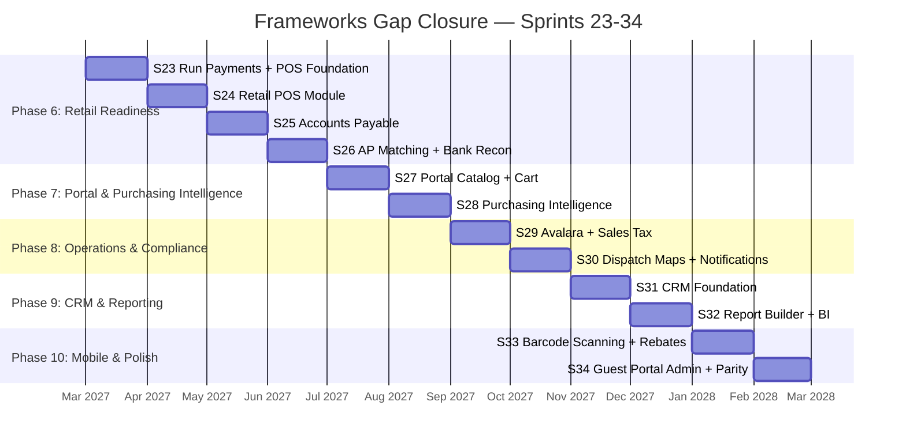

# Frameworks Gap Closure Roadmap

> **Purpose**: Sprint-by-sprint implementation plan to close all competitive gaps between GableERP and DMSi Frameworks ERP. Builds on [frameworks_gap_analysis.md](file:///home/colton/Desktop/4C%20Digital_HQ/Lumber%20Digital%20Tools/GableLBM/GableERP/productdocs/frameworks_gap_analysis.md) and extends the existing [roadmap.md](file:///home/colton/Desktop/4C%20Digital_HQ/Lumber%20Digital%20Tools/GableLBM/GableERP/productdocs/roadmap.md) (Sprints 1-22).
>
> **Default Payment Gateway**: [Run Payments](https://runpayments.io) — RESTful API, PCI-compliant tokenization via `Runner.js`, charge/capture/void/refund, hosted payment pages, reporting API.

---

## Roadmap Overview



---

## Gap-to-Sprint Mapping

| Gap ID | Gap | Sprint | Priority |
|:---|:---|:---:|:---:|
| **POS-1** | Run Payments integration | S23 | 🔴 P0 |
| **POS-2** | Retail POS module | S24 | 🔴 P0 |
| **F2** | Accounts Payable | S25-26 | 🔴 P0 |
| **F3** | Bank reconciliation | S26 | 🟡 P1 |
| **E1** | Portal product catalog | S27 | 🔴 P0 |
| **E2** | Online ordering / cart | S27 | 🟡 P1 |
| **PURCH-1** | Purchasing recommendations | S28 | 🔴 P0 |
| **PURCH-2** | Buying group EDI | S28 | 🟡 P1 |
| **IN2** | Sales tax automation (Avalara) | S29 | 🔴 P0 |
| **L1** | Customer delivery notifications | S30 | 🟡 P1 |
| **L2** | Driver on-site qty adjustments | S30 | 🟡 P1 |
| **DSP-1** | Google Maps dispatch integration | S30 | 🟡 P1 |
| **C1-C5** | CRM foundation | S31 | 🟡 P1 |
| **R1** | Ad-hoc report builder | S32 | 🟡 P1 |
| **R2-R3** | BI integration + scheduled reports | S32 | 🟢 P2 |
| **I4** | Barcode scanning | S33 | 🟡 P1 |
| **F8** | Rebate tracking | S33 | 🟢 P2 |
| **E4** | Guest portal user admin | S34 | 🟡 P1 |
| **PMD-1** | Project management dashboard | S34 | 🟡 P1 |

---

## Phase 6: Retail Readiness 🔴

> [!IMPORTANT]
> This is the highest-priority phase. Without POS and AP, GableERP cannot replace a dealer's existing system. **Run Payments** is the default gateway for all card processing.

---

### Sprint 23: Run Payments Integration + POS Foundation

**Goal**: Integrate Run Payments as the primary payment gateway and build the payment infrastructure that POS, portal, and AR all share.

**Duration**: 2 Weeks
**Focus**: Payment Gateway, Tokenization, PCI Compliance

#### 23.1 Run Payments Gateway Service

> [!NOTE]
> Run Payments uses RESTful APIs with JSON responses. Tokenization is handled client-side via `Runner.js` for PCI compliance — card data never touches our servers.

##### Backend — `backend/internal/payment/`

| File | Change | Details |
|:---|:---|:---|
| [MODIFY] [model.go](file:///home/colton/Desktop/4C%20Digital_HQ/Lumber%20Digital%20Tools/GableLBM/GableERP/backend/internal/payment/model.go) | Extend payment model | Add `GatewayTransactionID`, `GatewayStatus`, `TokenID`, `CardLast4`, `CardBrand`, `AuthCode` fields |
| [NEW] `gateway.go` | Gateway abstraction | Interface `PaymentGateway` with `Charge()`, `Capture()`, `Void()`, `Refund()`, `Tokenize()` methods |
| [NEW] `run_payments.go` | Run Payments implementation | HTTP client for Run Payments API — handles auth (`api_key` header), token-based charges, capture/void/refund flows |
| [NEW] `run_payments_test.go` | Integration tests | Mock HTTP server tests for each Run Payments API endpoint |
| [MODIFY] `service.go` | Wire gateway | Inject `PaymentGateway` interface, route CARD payments through Run Payments |
| [MODIFY] `handler.go` | Payment intent endpoint | New `POST /api/payments/intent` to create a payment session and return `Runner.js` public key |

##### Frontend — `app/src/`

| File | Change | Details |
|:---|:---|:---|
| [NEW] `components/RunPaymentsForm.tsx` | Tokenization component | Embed `Runner.js`, capture card input in PCI-compliant iframe, return token to backend |
| [MODIFY] Existing payment modals | Wire tokenization | Replace Stripe references with `RunPaymentsForm` component |

##### Database Migration

```sql
-- 023_run_payments.up.sql
ALTER TABLE payments ADD COLUMN gateway_tx_id VARCHAR(128);
ALTER TABLE payments ADD COLUMN gateway_status VARCHAR(32);
ALTER TABLE payments ADD COLUMN token_id VARCHAR(128);
ALTER TABLE payments ADD COLUMN card_last4 VARCHAR(4);
ALTER TABLE payments ADD COLUMN card_brand VARCHAR(16);
ALTER TABLE payments ADD COLUMN auth_code VARCHAR(32);

CREATE TABLE payment_refunds (
    id UUID PRIMARY KEY DEFAULT gen_random_uuid(),
    payment_id UUID NOT NULL REFERENCES payments(id),
    amount BIGINT NOT NULL,
    reason TEXT,
    gateway_refund_id VARCHAR(128),
    status VARCHAR(32) NOT NULL DEFAULT 'PENDING',
    created_at TIMESTAMPTZ NOT NULL DEFAULT NOW()
);
```

##### Configuration

```yaml
# config/config.yaml
run_payments:
  api_key: "${RUN_PAYMENTS_API_KEY}"
  public_key: "${RUN_PAYMENTS_PUBLIC_KEY}"
  api_base_url: "https://api.runpayments.io/v1"
  environment: "sandbox" # sandbox | production
```

#### 23.2 Tender Management Foundation

Build the multi-tender system that POS needs (split payments across cash, card, check, account).

##### Backend

| File | Change |
|:---|:---|
| [NEW] `backend/internal/payment/tender.go` | `TenderLine` model — supports splitting a transaction across multiple payment methods |
| [NEW] `backend/internal/payment/tender_service.go` | Tender orchestration — validates total tenders match invoice amount, processes each tender type |

##### Database Migration

```sql
-- 023b_tender_lines.up.sql
CREATE TABLE tender_lines (
    id UUID PRIMARY KEY DEFAULT gen_random_uuid(),
    invoice_id UUID NOT NULL REFERENCES invoices(id),
    payment_id UUID REFERENCES payments(id),
    method VARCHAR(16) NOT NULL, -- CASH, CARD, CHECK, ACCOUNT
    amount BIGINT NOT NULL,
    reference VARCHAR(128),
    created_at TIMESTAMPTZ NOT NULL DEFAULT NOW()
);
```

#### 23.3 Success Criteria

- [ ] Run Payments sandbox charge succeeds end-to-end (token → charge → confirm)
- [ ] Void and refund flows work against sandbox
- [ ] `Runner.js` tokenization form renders and returns valid tokens
- [ ] Multi-tender split payment (e.g., $500 cash + $1,200 card) processes correctly
- [ ] All existing payment tests continue to pass

---

### Sprint 24: Retail POS Module

**Goal**: Build a dedicated retail counter sales screen that seasonal staff can learn in under 10 minutes.

**Duration**: 2 Weeks
**Focus**: POS UI, Quick Sale Flow, Receipt Generation, Returns

#### 24.1 POS Backend

| File | Change | Details |
|:---|:---|:---|
| [NEW] `backend/internal/pos/` | New POS package | `model.go`, `service.go`, `repository.go`, `handler.go` |
| `pos/model.go` | POS transaction model | `POSTransaction` with line items, tenders, cashier ID, register ID, status (OPEN/COMPLETED/VOIDED/RETURNED) |
| `pos/service.go` | POS business logic | Quick lookup (scan/search), add to cart, apply pricing, calculate tax placeholder, tender, complete, void, return |
| `pos/handler.go` | POS API endpoints | `POST /api/pos/transactions`, `POST /api/pos/transactions/{id}/complete`, `POST /api/pos/transactions/{id}/void`, `POST /api/pos/transactions/{id}/return` |

##### Database Migration

```sql
-- 024_pos.up.sql
CREATE TABLE pos_transactions (
    id UUID PRIMARY KEY DEFAULT gen_random_uuid(),
    register_id VARCHAR(32) NOT NULL,
    cashier_id UUID NOT NULL,
    customer_id UUID,
    subtotal BIGINT NOT NULL DEFAULT 0,
    tax_amount BIGINT NOT NULL DEFAULT 0,
    total BIGINT NOT NULL DEFAULT 0,
    status VARCHAR(16) NOT NULL DEFAULT 'OPEN',
    completed_at TIMESTAMPTZ,
    created_at TIMESTAMPTZ NOT NULL DEFAULT NOW()
);

CREATE TABLE pos_line_items (
    id UUID PRIMARY KEY DEFAULT gen_random_uuid(),
    transaction_id UUID NOT NULL REFERENCES pos_transactions(id),
    product_id UUID NOT NULL,
    description VARCHAR(256) NOT NULL,
    quantity DECIMAL(12,4) NOT NULL,
    uom VARCHAR(16) NOT NULL,
    unit_price BIGINT NOT NULL,
    line_total BIGINT NOT NULL,
    created_at TIMESTAMPTZ NOT NULL DEFAULT NOW()
);

CREATE TABLE pos_registers (
    id VARCHAR(32) PRIMARY KEY,
    location_id UUID NOT NULL,
    name VARCHAR(64) NOT NULL,
    is_active BOOLEAN NOT NULL DEFAULT true,
    created_at TIMESTAMPTZ NOT NULL DEFAULT NOW()
);
```

#### 24.2 POS Frontend

| File | Change | Details |
|:---|:---|:---|
| [NEW] `app/src/pages/pos/POSTerminal.tsx` | Main POS screen | Full-screen counter view with product search, cart, tender buttons, receipt preview |
| [NEW] `app/src/pages/pos/POSReturns.tsx` | Returns screen | Lookup original transaction, select items to return, process refund via Run Payments |
| [NEW] `app/src/pages/pos/POSHistory.tsx` | Transaction history | Searchable list of completed transactions for the current register/day |
| [NEW] `app/src/services/posApi.ts` | POS API client | TypeScript service for all POS endpoints |
| [NEW] `app/src/components/pos/ProductQuickSearch.tsx` | Product search | Typeahead search by SKU, description, or barcode (manual entry) |
| [NEW] `app/src/components/pos/TenderPanel.tsx` | Tender panel | Cash/Card/Check/Account buttons, split payment UI, Run Payments card form |
| [NEW] `app/src/components/pos/ReceiptPreview.tsx` | Receipt component | Printable receipt with line items, tenders, and dealer branding |

##### POS UI Design

```
┌─────────────────────────────────────────────────────────────┐
│  🔍 Search product...          │  CUSTOMER: Walk-in (or select) │
├─────────────────────────────────┼───────────────────────────────┤
│  CART                           │                               │
│  ┌─────────────────────────┐   │   SUBTOTAL    $1,247.50       │
│  │ 2x4x8 SPF #2  x10  $65 │   │   TAX              $0.00     │
│  │ 2x6x12 DF #1   x4  $88 │   │   ─────────────────────────  │
│  │ Simpson HD2A   x20  $94 │   │   TOTAL       $1,247.50      │
│  │                         │   │                               │
│  └─────────────────────────┘   │  ┌─────┐ ┌─────┐ ┌───────┐  │
│                                 │  │CASH │ │CARD │ │CHECK  │  │
│                                 │  └─────┘ └─────┘ └───────┘  │
│                                 │  ┌─────────┐ ┌───────────┐  │
│                                 │  │ACCOUNT  │ │ SPLIT PAY │  │
│                                 │  └─────────┘ └───────────┘  │
│                                 │                               │
│  [VOID]     [HOLD]    [RECALL] │  [ COMPLETE SALE ]            │
└─────────────────────────────────┴───────────────────────────────┘
```

#### 24.3 Receipt Generation

| File | Change |
|:---|:---|
| [NEW] `backend/internal/pos/receipt.go` | Generate printable receipt (HTML-to-PDF or thermal printer format) |
| [NEW] `backend/internal/pos/receipt_template.go` | Dealer-branded receipt template with configurable header/footer |

#### 24.4 POS ↔ Existing Modules Integration

| Integration | How |
|:---|:---|
| **Inventory** | POS completion triggers inventory deduction via existing `inventory` service |
| **Invoice** | POS completion auto-generates invoice via existing `invoice` service |
| **Payment** | Tenders processed through existing `payment` service (now with Run Payments) |
| **GL** | Invoice + payment auto-post journal entries via existing `gl` service |
| **Pricing** | Product prices pulled from existing `pricing` waterfall |
| **Customer** | Optional customer association for account charges and loyalty |

#### 24.5 Success Criteria

- [ ] Counter rep can ring up a 5-item sale in under 60 seconds
- [ ] Cash, card (via Run Payments), check, and account tenders all process correctly
- [ ] Split payment (cash + card) works end-to-end
- [ ] Returns process refund through Run Payments and restore inventory
- [ ] Receipt generates with dealer branding
- [ ] Seasonal hire can learn the POS screen in < 10 minutes (UX goal)
- [ ] Daily till reconciliation includes POS transactions

---

### Sprint 25: Accounts Payable — Core

**Goal**: Build vendor invoice entry, approval workflows, and payment scheduling.

**Duration**: 2 Weeks
**Focus**: AP Engine, Vendor Invoices, Payment Scheduling

#### 25.1 AP Backend — `backend/internal/ap/`

| File | Change | Details |
|:---|:---|:---|
| [NEW] `model.go` | AP models | `VendorInvoice`, `VendorInvoiceLine`, `PaymentSchedule`, `APPayment`, `PaymentBatch` |
| [NEW] `repository.go` | AP data access | CRUD for vendor invoices, payment schedules, aging queries |
| [NEW] `service.go` | AP business logic | Invoice entry, approval workflow, aging calculation, payment batch creation |
| [NEW] `handler.go` | AP API endpoints | Full CRUD + batch payment endpoints |
| [NEW] `service_test.go` | Unit tests | Invoice entry, aging, batch payment orchestration |

##### Database Migration

```sql
-- 025_accounts_payable.up.sql
CREATE TABLE vendor_invoices (
    id UUID PRIMARY KEY DEFAULT gen_random_uuid(),
    vendor_id UUID NOT NULL REFERENCES vendors(id),
    invoice_number VARCHAR(64) NOT NULL,
    invoice_date DATE NOT NULL,
    due_date DATE NOT NULL,
    po_id UUID REFERENCES purchase_orders(id),
    subtotal BIGINT NOT NULL,
    tax_amount BIGINT NOT NULL DEFAULT 0,
    total BIGINT NOT NULL,
    amount_paid BIGINT NOT NULL DEFAULT 0,
    status VARCHAR(16) NOT NULL DEFAULT 'PENDING', -- PENDING, APPROVED, PARTIAL, PAID, VOIDED
    approved_by UUID,
    approved_at TIMESTAMPTZ,
    notes TEXT,
    created_at TIMESTAMPTZ NOT NULL DEFAULT NOW()
);

CREATE TABLE vendor_invoice_lines (
    id UUID PRIMARY KEY DEFAULT gen_random_uuid(),
    invoice_id UUID NOT NULL REFERENCES vendor_invoices(id),
    description VARCHAR(256) NOT NULL,
    quantity DECIMAL(12,4) NOT NULL,
    unit_price BIGINT NOT NULL,
    line_total BIGINT NOT NULL,
    gl_account_id UUID REFERENCES gl_accounts(id),
    created_at TIMESTAMPTZ NOT NULL DEFAULT NOW()
);

CREATE TABLE ap_payments (
    id UUID PRIMARY KEY DEFAULT gen_random_uuid(),
    vendor_id UUID NOT NULL REFERENCES vendors(id),
    batch_id UUID,
    amount BIGINT NOT NULL,
    method VARCHAR(16) NOT NULL, -- CHECK, ACH, WIRE
    check_number VARCHAR(32),
    reference VARCHAR(128),
    payment_date DATE NOT NULL,
    status VARCHAR(16) NOT NULL DEFAULT 'PENDING',
    created_at TIMESTAMPTZ NOT NULL DEFAULT NOW()
);

CREATE TABLE ap_payment_applications (
    id UUID PRIMARY KEY DEFAULT gen_random_uuid(),
    payment_id UUID NOT NULL REFERENCES ap_payments(id),
    invoice_id UUID NOT NULL REFERENCES vendor_invoices(id),
    amount BIGINT NOT NULL,
    created_at TIMESTAMPTZ NOT NULL DEFAULT NOW()
);
```

#### 25.2 AP Frontend

| File | Change | Details |
|:---|:---|:---|
| [NEW] `app/src/pages/accounting/VendorInvoices.tsx` | Invoice list | Filterable list with aging columns (Current, 30, 60, 90+) |
| [NEW] `app/src/pages/accounting/VendorInvoiceEntry.tsx` | Invoice entry | Manual entry + PO auto-populate, GL account assignment per line |
| [NEW] `app/src/pages/accounting/APPayments.tsx` | Payment management | Create payment batches, select invoices, choose payment method |
| [NEW] `app/src/pages/accounting/APAgingReport.tsx` | AP aging report | Mirror of AR aging report, for vendor payables |
| [NEW] `app/src/services/apApi.ts` | AP API client | TypeScript service |

#### 25.3 GL Integration

- Vendor invoice approval auto-posts: `DR: Expense/Inventory, CR: Accounts Payable`
- AP payment auto-posts: `DR: Accounts Payable, CR: Cash/Bank`
- Period-end AP accruals support

#### 25.4 Success Criteria

- [ ] Enter a vendor invoice with 5 line items in under 2 minutes
- [ ] PO-linked invoices auto-populate quantities and amounts
- [ ] AP aging report shows correct 30/60/90 buckets
- [ ] Approve → pay → GL posting flow works end-to-end
- [ ] Payment batch can pay multiple invoices for same vendor in one check

---

### Sprint 26: AP PO Matching + Bank Reconciliation

**Goal**: Complete AP with 3-way matching and add bank reconciliation for cash management.

**Duration**: 2 Weeks
**Focus**: PO Matching, Bank Reconciliation, ACH Support

#### 26.1 Three-Way PO Matching

| Component | Details |
|:---|:---|
| **Match Logic** | Compare PO → Receiving → Vendor Invoice quantities and amounts |
| **Tolerance Config** | Configurable variance thresholds (e.g., ±2% or $50) |
| **Exception Workflow** | Flag mismatches for manual review, auto-approve within tolerance |
| **UI** | Side-by-side comparison view: PO vs. Receipt vs. Invoice |

##### Backend

| File | Change |
|:---|:---|
| [NEW] `backend/internal/ap/matching.go` | Three-way match engine |
| [NEW] `backend/internal/ap/matching_test.go` | Test exact match, within tolerance, over tolerance, partial receipt |

#### 26.2 Bank Reconciliation

##### Backend — `backend/internal/banking/`

| File | Change |
|:---|:---|
| [NEW] `model.go` | `BankAccount`, `BankTransaction`, `Reconciliation` models |
| [NEW] `service.go` | Import bank statement (CSV/OFX), auto-match to GL transactions, flag unmatched |
| [NEW] `handler.go` | API endpoints for bank accounts, statement import, reconciliation |

##### Frontend

| File | Change |
|:---|:---|
| [NEW] `app/src/pages/accounting/BankAccounts.tsx` | Bank account list and setup |
| [NEW] `app/src/pages/accounting/BankReconciliation.tsx` | Interactive reconciliation UI — match/unmatch transactions |

##### Database Migration

```sql
-- 026_banking.up.sql
CREATE TABLE bank_accounts (
    id UUID PRIMARY KEY DEFAULT gen_random_uuid(),
    name VARCHAR(128) NOT NULL,
    account_number VARCHAR(32),
    routing_number VARCHAR(16),
    gl_account_id UUID NOT NULL REFERENCES gl_accounts(id),
    is_active BOOLEAN NOT NULL DEFAULT true,
    created_at TIMESTAMPTZ NOT NULL DEFAULT NOW()
);

CREATE TABLE bank_transactions (
    id UUID PRIMARY KEY DEFAULT gen_random_uuid(),
    bank_account_id UUID NOT NULL REFERENCES bank_accounts(id),
    transaction_date DATE NOT NULL,
    amount BIGINT NOT NULL,
    description VARCHAR(256),
    reference VARCHAR(128),
    matched_gl_tx_id UUID,
    reconciliation_id UUID,
    status VARCHAR(16) NOT NULL DEFAULT 'UNMATCHED',
    created_at TIMESTAMPTZ NOT NULL DEFAULT NOW()
);

CREATE TABLE reconciliations (
    id UUID PRIMARY KEY DEFAULT gen_random_uuid(),
    bank_account_id UUID NOT NULL REFERENCES bank_accounts(id),
    period_start DATE NOT NULL,
    period_end DATE NOT NULL,
    statement_balance BIGINT NOT NULL,
    gl_balance BIGINT NOT NULL,
    difference BIGINT NOT NULL DEFAULT 0,
    status VARCHAR(16) NOT NULL DEFAULT 'IN_PROGRESS',
    completed_by UUID,
    completed_at TIMESTAMPTZ,
    created_at TIMESTAMPTZ NOT NULL DEFAULT NOW()
);
```

#### 26.3 Success Criteria

- [ ] PO → receiving receipt → vendor invoice 3-way match auto-approves within tolerance
- [ ] Mismatches flag for manual review with side-by-side comparison
- [ ] Bank statement CSV import parses and creates transactions
- [ ] Auto-matching engine finds 80%+ of matches
- [ ] Reconciliation difference displays correctly and resolves to $0
- [ ] Bank reconciliation posts adjustments to GL

---

## Phase 7: Portal & Purchasing Intelligence 🟡

---

### Sprint 27: Portal Product Catalog + Online Ordering

**Goal**: Add product browsing and shopping cart to the existing contractor portal.

**Duration**: 2 Weeks
**Focus**: Product Catalog, Shopping Cart, Online Checkout

#### 27.1 Product Catalog

##### Backend

| File | Change |
|:---|:---|
| [NEW] `backend/internal/portal/catalog.go` | Portal-specific product listing with customer-specific pricing, images, availability |
| [MODIFY] `backend/internal/portal/handler.go` | Add `GET /api/portal/catalog`, `GET /api/portal/catalog/{id}` endpoints |

##### Frontend

| File | Change |
|:---|:---|
| [NEW] `app/src/pages/portal/PortalCatalog.tsx` | Browsable product grid with search, filters (category, species, grade) |
| [NEW] `app/src/pages/portal/PortalProductDetail.tsx` | Product detail page with specs, availability, customer-specific pricing |
| [NEW] `app/src/components/portal/ProductCard.tsx` | Reusable product card with image, price, add-to-cart button |

#### 27.2 Shopping Cart & Checkout

##### Backend

| File | Change |
|:---|:---|
| [NEW] `backend/internal/portal/cart.go` | Cart model and service — add/remove/update items, persist cart per customer session |
| [MODIFY] `backend/internal/portal/handler.go` | Add cart CRUD and checkout endpoints |

##### Frontend

| File | Change |
|:---|:---|
| [NEW] `app/src/pages/portal/PortalCart.tsx` | Cart page with quantity editing, order notes, delivery preference |
| [NEW] `app/src/pages/portal/PortalCheckout.tsx` | Checkout flow — confirm address, select delivery/pickup, payment (Run Payments or account charge), place order |
| [NEW] `app/src/components/portal/CartSidebar.tsx` | Persistent mini-cart sidebar showing item count and total |

#### 27.3 Portal ↔ Existing Modules

| Integration | How |
|:---|:---|
| **Pricing** | Catalog prices pulled from pricing waterfall with customer-specific tiers |
| **Inventory** | Real-time availability from inventory service |
| **Orders** | Checkout creates order via existing order service |
| **Payments** | Card payments via Run Payments; account charges via existing account flow |

#### 27.4 Success Criteria

- [ ] Contractor logs in and browses full product catalog with images
- [ ] Search and filter narrow results correctly
- [ ] Customer-specific pricing displays (not list price)
- [ ] Add to cart → checkout → order creation flow completes
- [ ] Order appears in ERP order list for dealer fulfillment
- [ ] "Quick Reorder" from existing [PortalOrders.tsx](file:///home/colton/Desktop/4C%20Digital_HQ/Lumber%20Digital%20Tools/GableLBM/GableERP/app/src/pages/portal/PortalOrders.tsx) still works

---

### Sprint 28: Purchasing Intelligence + Buying Group Integration

**Goal**: Add automated purchasing recommendations and connect to buying group catalogs via EDI.

**Duration**: 2 Weeks
**Focus**: Demand Forecasting, Auto-Reorder, Buying Group EDI

#### 28.1 Purchasing Recommendations Engine

##### Backend — `backend/internal/purchase_order/`

| File | Change |
|:---|:---|
| [NEW] `recommendations.go` | Analyze sales velocity, current stock, lead times; generate suggested POs |
| [NEW] `recommendations_test.go` | Test reorder point calculations, safety stock, seasonal adjustments |
| [MODIFY] `handler.go` | Add `GET /api/purchasing/recommendations` endpoint |

##### Frontend

| File | Change |
|:---|:---|
| [NEW] `app/src/pages/purchasing/PurchasingRecommendations.tsx` | Dashboard showing suggested reorders with one-click "Create PO" |
| [MODIFY] [NewPurchaseOrder.tsx](file:///home/colton/Desktop/4C%20Digital_HQ/Lumber%20Digital%20Tools/GableLBM/GableERP/app/src/pages/purchasing/NewPurchaseOrder.tsx) | Add "From Recommendation" pre-fill option |

##### Logic

```
Reorder Point = (Avg Daily Sales × Lead Time Days) + Safety Stock
Safety Stock = Z-score × StdDev(Daily Sales) × √Lead Time Days
Suggested Qty = EOQ or Round-up to vendor minimum
```

#### 28.2 Buying Group EDI Integration

##### Backend — `backend/internal/edi/`

| File | Change |
|:---|:---|
| [NEW] `buying_group.go` | Process 832 (Price/Sales Catalog) and 846 (Inventory Inquiry) documents |
| [MODIFY] existing EDI handler | Add buying group catalog sync endpoints |

#### 28.3 Supplier Catalog Sync

| Feature | Details |
|:---|:---|
| **Catalog Import** | Parse supplier price lists (EDI 832 or CSV) into product/pricing tables |
| **Price Comparison** | Show current cost vs. catalog price on PO entry |
| **Auto-Update** | Scheduled sync of supplier pricing (daily or on-demand) |

#### 28.4 Success Criteria

- [ ] Recommendations engine identifies items below reorder point
- [ ] One-click "Create PO" from recommendation populates PO with suggested quantities
- [ ] Buying group catalog import populates supplier pricing
- [ ] PO entry shows real-time supplier cost comparison
- [ ] Recommendations adjust for seasonal patterns (if 6+ months of data available)

---

## Phase 8: Operations & Compliance 🟡

---

### Sprint 29: Avalara Sales Tax Integration

**Goal**: Automated, jurisdiction-aware sales tax calculation on every transaction.

**Duration**: 1 Week
**Focus**: Avalara AvaTax API, Tax Engine, Compliance

#### 29.1 Tax Engine — `backend/internal/tax/`

| File | Change |
|:---|:---|
| [NEW] `model.go` | `TaxResult`, `TaxLine`, `TaxExemption` models |
| [NEW] `avalara.go` | Avalara AvaTax REST API client — calculate tax, commit, void, adjust |
| [NEW] `service.go` | Tax service abstracting Avalara — called by POS, invoice, and portal checkout |
| [NEW] `handler.go` | Tax preview endpoint for real-time UI display |
| [NEW] `exemptions.go` | Tax exemption certificate management (contractors often have exemptions) |

#### 29.2 Integration Points

| Module | Integration |
|:---|:---|
| **POS** | Real-time tax calculation on cart total, by delivery address or store location |
| **Invoicing** | Tax calculated and committed on invoice finalization |
| **Portal Checkout** | Tax preview on cart, committed on order placement |
| **Returns** | Tax reversal on refund/return transactions |

#### 29.3 Configuration

```yaml
avalara:
  account_id: "${AVALARA_ACCOUNT_ID}"
  license_key: "${AVALARA_LICENSE_KEY}"
  environment: "sandbox" # sandbox | production
  company_code: "${AVALARA_COMPANY_CODE}"
```

#### 29.4 Success Criteria

- [ ] POS cart shows real-time tax based on store jurisdiction
- [ ] Delivery orders calculate tax based on delivery address
- [ ] Tax-exempt contractor orders skip tax calculation
- [ ] Invoice tax commits to Avalara for filing
- [ ] Returns properly reverse committed tax

---

### Sprint 30: Dispatch Maps + Delivery Notifications

**Goal**: Google Maps integration for route planning and automated customer delivery notifications.

**Duration**: 2 Weeks
**Focus**: Google Maps API, SMS/Email Notifications, Driver Adjustments

#### 30.1 Google Maps Dispatch Integration

##### Backend

| File | Change |
|:---|:---|
| [NEW] `backend/internal/delivery/maps.go` | Google Maps Directions API — optimize stop sequence, calculate ETAs |
| [MODIFY] `backend/internal/delivery/service.go` | Add route optimization and ETA calculation |

##### Frontend

| File | Change |
|:---|:---|
| [MODIFY] [DispatchBoard.tsx](file:///home/colton/Desktop/4C%20Digital_HQ/Lumber%20Digital%20Tools/GableLBM/GableERP/app/src/pages/DispatchBoard.tsx) | Embed Google Maps with route visualization, drag-and-drop stop reordering on map |
| [NEW] `app/src/components/dispatch/RouteMap.tsx` | Map component showing stops, truck position, and ETAs |

#### 30.2 Customer Delivery Notifications

##### Backend — `backend/internal/notification/`

| File | Change |
|:---|:---|
| [NEW] `sms.go` | SMS notification service (Twilio or similar) |
| [NEW] `email_notifications.go` | Email notification templates for delivery status |
| [NEW] `delivery_events.go` | Listen for delivery status changes, trigger appropriate notifications |

##### Notification Types

| Status Change | Customer Notification |
|:---|:---|
| Order → Staged | "Your order #{num} is being prepared for delivery" |
| Staged → Out for Delivery | "Your delivery is on the way! ETA: {time}" |
| Delivered (POD captured) | "Your delivery has been completed. [View receipt]" |

#### 30.3 Driver On-Site Quantity Adjustments

| File | Change |
|:---|:---|
| [MODIFY] [DeliveryDetail.tsx](file:///home/colton/Desktop/4C%20Digital_HQ/Lumber%20Digital%20Tools/GableLBM/GableERP/app/src/pages/driver/DeliveryDetail.tsx) | Add quantity adjustment UI for short-ship scenarios |
| [MODIFY] `backend/internal/delivery/service.go` | Handle quantity adjustments, trigger invoice correction |

#### 30.4 Success Criteria

- [ ] Dispatch board shows stops on Google Maps with estimated route duration
- [ ] Drag-and-drop stop reorder recalculates route
- [ ] Customer receives SMS/email at each delivery milestone
- [ ] Driver can adjust delivered quantity on-site with reason code
- [ ] Quantity adjustment triggers invoice correction and notifies AP

---

## Phase 9: CRM & Reporting 🟡

---

### Sprint 31: CRM Foundation

**Goal**: Build contact management, activity tracking, and customer self-service account editing.

**Duration**: 2 Weeks
**Focus**: Contacts, Activities, Self-Service

#### 31.1 Contact Management — `backend/internal/customer/`

| File | Change |
|:---|:---|
| [NEW] `contacts.go` | `Contact` model — multiple contacts per customer with roles (Buyer, AP, Owner, Site Super) |
| [MODIFY] `handler.go` | Add contact CRUD endpoints under customer |

##### Frontend

| File | Change |
|:---|:---|
| [NEW] `app/src/pages/accounts/ContactList.tsx` | Contact management per customer account |

#### 31.2 Activity Tracking

| File | Change |
|:---|:---|
| [NEW] `backend/internal/crm/` | New CRM package: `Activity` model (calls, meetings, emails, notes), linked to customer |
| [NEW] `app/src/pages/accounts/ActivityFeed.tsx` | Timeline of customer interactions |
| [NEW] `app/src/components/crm/LogActivityModal.tsx` | Quick-log call/meeting/note |

#### 31.3 Customer Self-Service (Portal Enhancement)

| File | Change |
|:---|:---|
| [MODIFY] [PortalDashboard.tsx](file:///home/colton/Desktop/4C%20Digital_HQ/Lumber%20Digital%20Tools/GableLBM/GableERP/app/src/pages/portal/PortalDashboard.tsx) | Add "My Account" section with edit capabilities |
| [NEW] `app/src/pages/portal/PortalMyAccount.tsx` | Self-service: update contact info, manage addresses, set communication preferences |

#### 31.4 Success Criteria

- [ ] Multiple contacts per customer with distinct roles
- [ ] Sales rep can log a call in < 30 seconds
- [ ] Activity feed shows chronological history
- [ ] Contractor can update their own contact info in portal
- [ ] Customer changes in portal sync to ERP in real-time

---

### Sprint 32: Report Builder + BI Integration

**Goal**: Ad-hoc report builder and external BI tool connectivity.

**Duration**: 2 Weeks
**Focus**: Report Builder, Data Export, BI Connectors

#### 32.1 Ad-Hoc Report Builder

| File | Change |
|:---|:---|
| [NEW] `backend/internal/reporting/builder.go` | Query builder — user selects entity (orders, invoices, inventory), columns, filters, groupings |
| [NEW] `backend/internal/reporting/export.go` | Export to CSV, XLSX, PDF |
| [NEW] `app/src/pages/reports/ReportBuilder.tsx` | Drag-and-drop report designer UI |
| [NEW] `app/src/pages/reports/SavedReports.tsx` | List of saved report definitions |

#### 32.2 Scheduled Report Distribution

| File | Change |
|:---|:---|
| [NEW] `backend/internal/reporting/scheduler.go` | Cron-based report execution and email delivery |

#### 32.3 BI Integration

| Feature | Details |
|:---|:---|
| **Read-Only Database Replica** | Provide connection string for Power BI / Tableau direct connect |
| **API Data Endpoints** | Structured JSON exports for BI tool consumption |
| **Schema Documentation** | Auto-generated ERD and data dictionary for BI users |

#### 32.4 Success Criteria

- [ ] User creates custom report selecting columns, filters, and groupings
- [ ] Report exports correctly to CSV and XLSX
- [ ] Saved report can be scheduled for daily email delivery
- [ ] BI tool (Power BI / Tableau) can connect and pull data

---

## Phase 10: Mobile & Polish 🟢

---

### Sprint 33: Barcode Scanning + Rebate Tracking

**Goal**: Native barcode scanning in yard workflows and vendor rebate management.

**Duration**: 2 Weeks
**Focus**: Camera-Based Barcode Scanning, Rebate Engine

#### 33.1 Barcode Scanning

| File | Change |
|:---|:---|
| [NEW] `app/src/components/BarcodeScanner.tsx` | Camera-based barcode reader using [html5-qrcode](https://github.com/nicbarker/html5-qrcode) or similar |
| [MODIFY] [InventoryLookup.tsx](file:///home/colton/Desktop/4C%20Digital_HQ/Lumber%20Digital%20Tools/GableLBM/GableERP/app/src/pages/yard/InventoryLookup.tsx) | Add scan-to-search |
| [MODIFY] [CycleCount.tsx](file:///home/colton/Desktop/4C%20Digital_HQ/Lumber%20Digital%20Tools/GableLBM/GableERP/app/src/pages/yard/CycleCount.tsx) | Add scan-to-count |
| [MODIFY] [ReceivePO.tsx](file:///home/colton/Desktop/4C%20Digital_HQ/Lumber%20Digital%20Tools/GableLBM/GableERP/app/src/pages/yard/ReceivePO.tsx) | Add scan-to-receive |
| [MODIFY] POS Terminal | Add scan-to-add-to-cart |

#### 33.2 Vendor Rebate Tracking

| File | Change |
|:---|:---|
| [NEW] `backend/internal/pricing/rebates.go` | Rebate program management — volume thresholds, percentage tiers, period tracking |
| [NEW] `app/src/pages/purchasing/RebatePrograms.tsx` | Rebate program setup and tracking dashboard |
| [NEW] `app/src/pages/purchasing/RebateReport.tsx` | Earned vs. claimed rebate comparison report |

##### Database Migration

```sql
-- 033_rebates.up.sql
CREATE TABLE rebate_programs (
    id UUID PRIMARY KEY DEFAULT gen_random_uuid(),
    vendor_id UUID NOT NULL REFERENCES vendors(id),
    name VARCHAR(128) NOT NULL,
    program_type VARCHAR(16) NOT NULL, -- VOLUME, GROWTH, PRODUCT_MIX
    start_date DATE NOT NULL,
    end_date DATE NOT NULL,
    is_active BOOLEAN NOT NULL DEFAULT true,
    created_at TIMESTAMPTZ NOT NULL DEFAULT NOW()
);

CREATE TABLE rebate_tiers (
    id UUID PRIMARY KEY DEFAULT gen_random_uuid(),
    program_id UUID NOT NULL REFERENCES rebate_programs(id),
    min_volume BIGINT NOT NULL,
    max_volume BIGINT,
    rebate_pct DECIMAL(5,4) NOT NULL,
    created_at TIMESTAMPTZ NOT NULL DEFAULT NOW()
);

CREATE TABLE rebate_claims (
    id UUID PRIMARY KEY DEFAULT gen_random_uuid(),
    program_id UUID NOT NULL REFERENCES rebate_programs(id),
    period_start DATE NOT NULL,
    period_end DATE NOT NULL,
    qualifying_volume BIGINT NOT NULL,
    rebate_amount BIGINT NOT NULL,
    status VARCHAR(16) NOT NULL DEFAULT 'CALCULATED',
    claimed_at TIMESTAMPTZ,
    created_at TIMESTAMPTZ NOT NULL DEFAULT NOW()
);
```

#### 33.3 Success Criteria

- [ ] Phone camera scans barcode and populates product in inventory lookup
- [ ] Scan-to-count works in cycle count flow
- [ ] Scan-to-receive works in PO receiving flow
- [ ] POS scan adds product to cart
- [ ] Rebate program tracks volume against tiers and calculates earned rebate
- [ ] Rebate report shows earned vs. claimed for each vendor program

---

### Sprint 34: Guest Portal Administration + Project Dashboard

**Goal**: Contractor team management in portal and centralized project management view.

**Duration**: 2 Weeks
**Focus**: Portal Multi-User, Project Dashboard, Parity Verification

#### 34.1 Guest Portal User Administration

| File | Change |
|:---|:---|
| [NEW] `backend/internal/portal/users.go` | Portal user management — invite, roles (Admin, Buyer, View-Only), deactivate |
| [NEW] `app/src/pages/portal/PortalTeam.tsx` | Contractor manages their team's portal access |
| [NEW] `app/src/pages/portal/PortalInvite.tsx` | Invite flow with email + role assignment |

#### 34.2 Project Management Dashboard

| File | Change |
|:---|:---|
| [NEW] `backend/internal/project/` | New package: `Project` model linking multiple orders, deliveries, and invoices to a single job |
| [NEW] `app/src/pages/projects/ProjectDashboard.tsx` | Centralized view: all orders, pick tickets, deliveries, and invoices for a job |
| [NEW] `app/src/pages/projects/ProjectList.tsx` | List of active projects with status indicators |

#### 34.3 Parity Verification Checklist

Final verification that all Frameworks gaps have been closed:

| Feature | Sprint | Status |
|:---|:---:|:---:|
| Run Payments integration | S23 | ☐ |
| Retail POS module | S24 | ☐ |
| Accounts Payable | S25 | ☐ |
| 3-Way PO Matching | S26 | ☐ |
| Bank Reconciliation | S26 | ☐ |
| Portal Product Catalog | S27 | ☐ |
| Online Ordering / Cart | S27 | ☐ |
| Purchasing Recommendations | S28 | ☐ |
| Buying Group EDI | S28 | ☐ |
| Avalara Sales Tax | S29 | ☐ |
| Google Maps Dispatch | S30 | ☐ |
| Customer Notifications | S30 | ☐ |
| Driver Qty Adjustments | S30 | ☐ |
| CRM Contacts | S31 | ☐ |
| Activity Tracking | S31 | ☐ |
| Customer Self-Service | S31 | ☐ |
| Report Builder | S32 | ☐ |
| BI Integration | S32 | ☐ |
| Barcode Scanning | S33 | ☐ |
| Rebate Tracking | S33 | ☐ |
| Guest Portal Admin | S34 | ☐ |
| Project Dashboard | S34 | ☐ |

#### 34.4 Success Criteria

- [ ] Contractor admin can invite team members with specific roles
- [ ] Team member with "View-Only" cannot place orders
- [ ] Project dashboard shows unified view of multi-job build
- [ ] All 22 gap items from the parity checklist above are verified functional

---

## Timeline Summary

| Sprint | Phase | Duration | Key Deliverable |
|:---|:---|:---:|:---|
| **S23** | 6: Retail Readiness | 2 wks | Run Payments + tender management |
| **S24** | 6: Retail Readiness | 2 wks | Retail POS module |
| **S25** | 6: Retail Readiness | 2 wks | Accounts Payable core |
| **S26** | 6: Retail Readiness | 2 wks | PO matching + bank reconciliation |
| **S27** | 7: Portal & Purchasing | 2 wks | Portal catalog + online ordering |
| **S28** | 7: Portal & Purchasing | 2 wks | Purchasing intelligence + buying groups |
| **S29** | 8: Ops & Compliance | 1 wk | Avalara sales tax |
| **S30** | 8: Ops & Compliance | 2 wks | Maps, notifications, driver adjustments |
| **S31** | 9: CRM & Reporting | 2 wks | CRM foundation |
| **S32** | 9: CRM & Reporting | 2 wks | Report builder + BI |
| **S33** | 10: Mobile & Polish | 2 wks | Barcode scanning + rebates |
| **S34** | 10: Mobile & Polish | 2 wks | Guest admin + project dashboard |

**Total estimated duration: ~23 weeks (6 months)**
**Estimated parity date: Q4 2027**

> [!IMPORTANT]
> After Sprint 34, GableERP will have **complete feature parity** with DMSi Frameworks for every documented capability, PLUS the existing Gable advantages (AI vision, millwork configurator, yard management, open source, governance). At that point, there is no functional reason a dealer would choose Frameworks over Gable.
